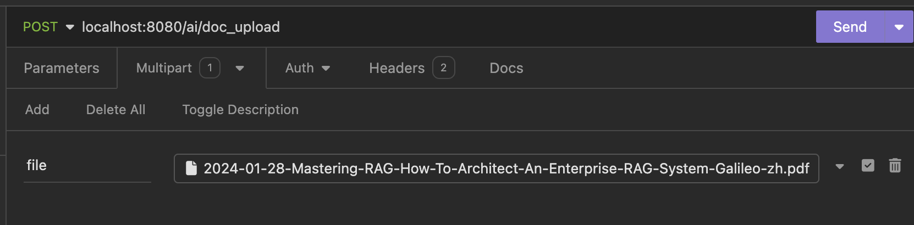
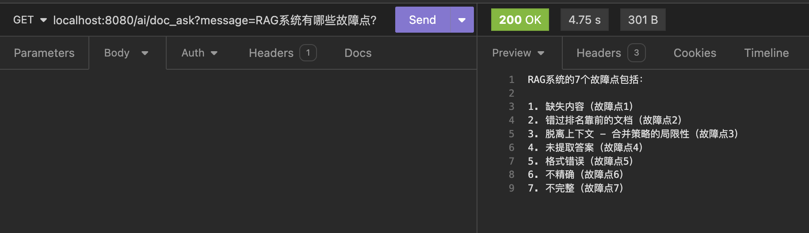

# A simple example of building RAG using Spring AI and PGVector

## 1. Run Postgres & PGVector DB locally with docker
```bash
docker pull ankane/pgvector

docker run -d --name postgres_spring_ai -p 5432:5432 -e POSTGRES_USER=postgres -e POSTGRES_PASSWORD=postgres ankane/pgvector
```

## 2. connect to DB and create EXTENSIONs and table
```sql
CREATE EXTENSION IF NOT EXISTS vector;
CREATE EXTENSION IF NOT EXISTS hstore;
CREATE EXTENSION IF NOT EXISTS "uuid-ossp";

CREATE TABLE IF NOT EXISTS vector_store (
	id uuid DEFAULT uuid_generate_v4() PRIMARY KEY,
	content text,
	metadata json,
	embedding vector(1536)
);

CREATE INDEX ON vector_store USING HNSW (embedding vector_cosine_ops);
```

## 3. replace ${OPEN_AI_API_KEY} in application.yaml with OpenAI APIKey

## 4. run AIApplication.java, upload pdf files, then you can ask questions about the pdf files contents.
e.g.

